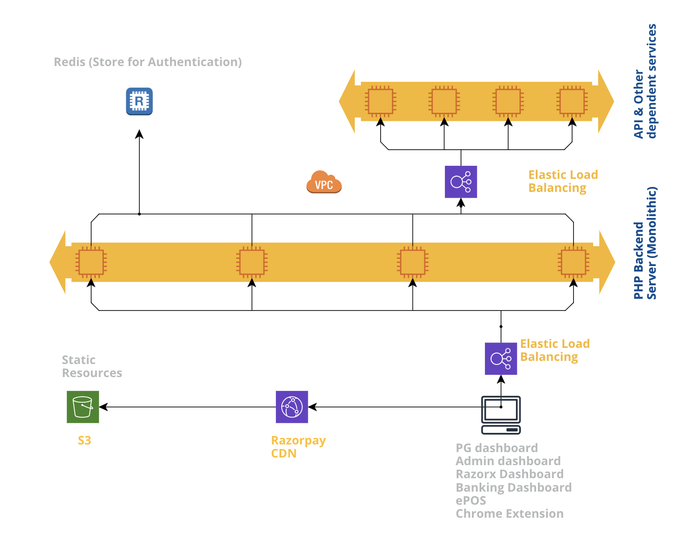
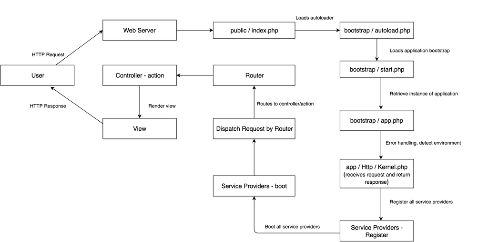
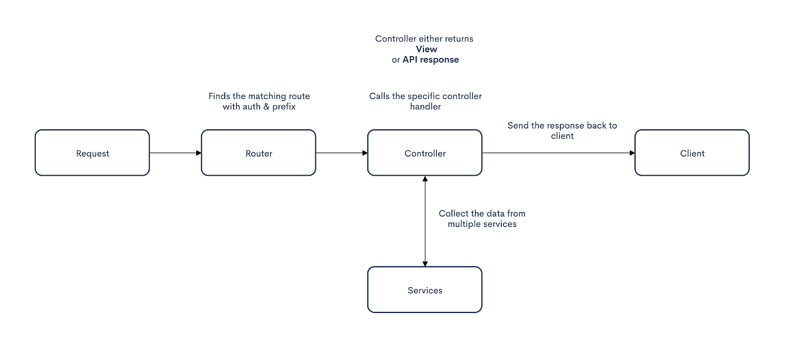

<header>
  <h1 align="center">Dashboard Backend Architecture</h1>
  <details>
    <summary align="center"><b>Changelog</b></summary>

| Version | Creators             | Reviewers                                                                                                                        | Remarks     |
| ------- | -------------------- | -------------------------------------------------------------------------------------------------------------------------------- | ----------- |
| 1.0     | `Sandesh Damkondwar` | `Anshul Sahni` `Kamlesh Chandnani` `Dhruvdutt Jadhav` `Kevin Jose` `Aakash Raina` `Prashant Chaudhary` `Rajat Prakash Chowdhary` | First Draft |

  </details>
</header>

- [1. Summary](#1-summary)
- [2. Current Architecture](#2-current-architecture)
- [3. Functionalities of Dashboard Backend](#3-functionalities-of-dashboard-backend)
- [4. Applications Using Dashboard Backend](#4-applications-using-dashboard-backend)
- [5. Dashboard Guide](#5-dashboard-guide)
  - [5.1. Request lifecycle](#51-request-lifecycle)
  - [5.2. A simplified picture of the request workflow](#52-a-simplified-picture-of-the-request-workflow)
- [6. AuthN \& AuthZ](#6-authn--authz)
  - [6.1. How auth is working](#61-how-auth-is-working)
- [7. Session](#7-session)
  - [7.1. How does the session work?](#71-how-does-the-session-work)
- [8. Proxy](#8-proxy)
  - [8.1. Different types of proxies and how it works?](#81-different-types-of-proxies-and-how-it-works)
- [9. Notifications](#9-notifications)
- [10. Issues with Dashboard Backend](#10-issues-with-dashboard-backend)
- [11. Challenges / Tech Debts](#11-challenges--tech-debts)
- [12. Big Tech Debts](#12-big-tech-debts)
  - [12.1. Get User Details](#121-get-user-details)
- [13. Current \& planned measures for Tech Debts/Decomposition](#13-current--planned-measures-for-tech-debtsdecomposition)
  - [13.1. Current ongoing measures](#131-current-ongoing-measures)
  - [13.2. Future measures](#132-future-measures)
- [14. POC Teams](#14-poc-teams)
  - [14.1. Ownership breakup by middleware](#141-ownership-breakup-by-middleware)
  - [14.2. Ownership breakup by routes](#142-ownership-breakup-by-routes)
  - [14.3. Ownership breakup by Dashboard/Service (Frontend/Service level only)](#143-ownership-breakup-by-dashboardservice-frontendservice-level-only)
- [15. References](#15-references)
- [16. Future Scope](#16-future-scope)

### 1. Summary

This documentation provides a deep dive into the dashboard backend. There are a lot of teams working on this dashboard backend and now there is no proper owner of this. There was no one such documentation that provided a complete view of this dashboard. Trying to cover all the components and functionalities of this dashboard to make developers aware of those.

### 2. Current Architecture



<https://app.cloudcraft.co/view/f8b8278a-9df2-43c2-b562-22d987486339?key=K_4VQx55EHvhgf3Qzl2bnw&interactive=true&embed=true>

### 3. Functionalities of Dashboard Backend

| Functionality                        | Description                                                                                                                                                                                                                                                                                                         | How to Decompose?                                                                                                                                                                                                                                                                                                                                                                                               |
| ------------------------------------ | ------------------------------------------------------------------------------------------------------------------------------------------------------------------------------------------------------------------------------------------------------------------------------------------------------------------- | --------------------------------------------------------------------------------------------------------------------------------------------------------------------------------------------------------------------------------------------------------------------------------------------------------------------------------------------------------------------------------------------------------------- |
| Application gateway                  | The dashboard is exposed to the public N/W, all the requests will be landed here and redirected/proxied to the services, based on the route & session data, session management is explained below.                                                                                                                  | Route redirection can be done via HAProxy configs.                                                                                                                                                                                                                                                                                                                                                              |
| Session Management                   | Creating, Storing & Updating tokens for authentication                                                                                                                                                                                                                                                              | Tools team as a part of EDGE services is working on solutions for Authorization, Authentication & Session Mgmt. as separate services For more info 👇1. [Authentication](https://docs.google.com/document/d/1Z6AoN4QrS6uyA7FnxHKdjiJ6FD9TmmqG7vc4Zsoi55c/edit#heading=h.9castougfi8w) 2. [Authorization as a service](https://docs.google.com/document/u/1/d/180QSbJPevAjNnDnmPA67k5OVt98k-dvpWkX5TMA4qyg/edit) |
| Web Server                           | All applications excluding ePOS are rendered from the dashboard’s PHP code. Few data pointers are received as global js variables since they’re dumped by the initial render code. [Link of file rendering the FE code](https://github.com/razorpay/dashboard/blob/master/resources/views/merchant/index.blade.php) | ~~The banking dashboard’s first root index.html is served from CDN just like any other js or CSS asset. Everything dumped by dashboard BE can be requested from the server using API calls~~ [~~Link to the source file used for creating served index.html~~](https://github.com/razorpay/x/blob/master/src/html/index.hbs)                                                                                    |
| Proxy Layer between FE & BE services | Any FE application can’t talk to Backend services directly, since either they’re protected by basic auth, or are not accessible from outside                                                                                                                                                                        | All frontend applications should use GraphQL, as that will act as a federation layer between FE and various BE services. [Dashboard android app](https://github.com/razorpay/frontend-commander) is already using this scheme [Link to GraphQL tech](https://drive.google.com/a/razorpay.com/open?id=16Jbwthm-yByeLTLYP_72FWWL1PTLdH9dal8fsbP2Ydw)                                                              |
| Combine APIs response                | There are APIs like /user which gathers response from multiple resources and combine them together and send it back to client                                                                                                                                                                                       | 1. To mitigate this. Split these types of API into multiple and make direct calls to the main API endpoint from the client. 2. Move these kinds of APIs to the API repo 3. Use the graphQL API if already present                                                                                                                                                                                               |
| Wrapper/Enrichment for APIs          | API responses are wrapped with data and errors. No matter what the response is, the dashboard backend will send the 200 with API response data and error.                                                                                                                                                           | Handling those errors on the client side requires huge efforts but efforts can be minimized by adding the wrapper on fetch calls.                                                                                                                                                                                                                                                                               |
| Emailer                              | Mailer is taking care of sending emails like, feedback mail, notification on activation, confirming activation submission                                                                                                                                                                                           | This can be moved to the [email templating service](https://github.com/razorpay/email-templating-service)                                                                                                                                                                                                                                                                                                       |

### 4. Applications Using Dashboard Backend

| Application/Functionalities                                                                                           | Session Management | Acting as Web Server | Proxy Layer | Data Transformation | Rendering |
| --------------------------------------------------------------------------------------------------------------------- | ------------------ | -------------------- | ----------- | ------------------- | --------- |
| [Merchant dashboard](https://dashboard.razorpay.com) 👩‍💻                                                               | ✅                 | ✅                   | ✅          | ✅                  | ✅        |
| [Admin dashboard](https://admin-dashboard.razorpay.com/admin) 👩‍💻                                                      | ✅                 | ✅                   | ✅          | ✅                  | ✅        |
| [Razorx Dashboard](https://admin-dashboard.razorpay.com/razorx) 👩‍💻                                                    | ✅                 | ✅                   | ✅          | ✅                  | ✅        |
| [Banking Dashboard](http://x.razorpay.com/) 👩‍💻                                                                        | ✅                 | ❌                   | ✅          | ✅                  | ✅        |
| [GraphQL layer](https://github.com/razorpay/frontend-graphql) 👩‍💻                                                      | ✅                 | ❌                   | ❌          | ✅                  | ❌        |
| [ePOS mobile App](https://play.google.com/store/apps/details?id=com.razorpay.leprechaun&hl=en_IN) (android)           | ✅                 | ❌                   | ✅          | ❌                  | ❌        |
| PG Mobile App                                                                                                         | ✅                 | ❌                   | ✅          | ✅                  | ❌        |
| [Chrome Extension](https://chrome.google.com/webstore/detail/razorpay-payment-links/dhljamfnjmgmoecphfdmjpiblhhamolo) | ✅                 | ❌                   | ✅          | ❌                  | ❌        |

👩‍💻 _- active development_

### 5. Dashboard Guide

#### 5.1. Request lifecycle



[Details on lifecycle components](https://laravel.com/docs/5.8/lifecycle)

#### 5.2. A simplified picture of the request workflow



### 6. AuthN & AuthZ

Authentications available-

- Google OAuth
- Password-based login

Authorizations available -

- `auth` - User is logged in
- `admin_access` - User is logged in on the admin
- `superadmin` - All the permissions are allowed to this user
- `verified` - User is logged in & verified
- `auth.oauth` - Used only for getting the user token details

#### 6.1. How auth is working

TBA

### 7. Session

#### 7.1. How does the session work?

TBA

### 8. Proxy

#### 8.1. Different types of proxies and how it works?

TBA

### 9. Notifications

TBA

### 10. Issues with Dashboard Backend

- The legacy codebase and obsolete framework
- **No team has proper ownership**
- Lots of dead code & tech debts _(ex: dashboard connects to MySQL database for no use)_
- No test integrations
- It’s a monolith that does Gateway routing, session management, and rendering. Basically, it doesn’t have a defined responsibility

### 11. Challenges / Tech Debts

1. **Problem -** Have seen a lot of frequent commits just to change the constants just for adding notifications on the dashboard

   **Solutions -** Move this as a service to [stork](https://github.com/razorpay/stork) or [API](https://github.com/razorpay/api)

2. **Problem** - Other frequent commits on the backend consist of env or timeout-related changes.

   **Solutions -** We can use already existing consul kV store infrastructure, credstash, or deployment configs in order to mitigate these unnecessary deployments

### 12. Big Tech Debts

#### 12.1. Get User Details

This is the biggest tech debt IMO. `Get User Details` call in the user controller is gathering responses from multiple API calls from **API** service and putting it together to send that back to the client. This is a render blocking call and currently, it’s taking 5-6 seconds on page load.

This action is called on the below routes:

```
'/' - Merchant Dashboard's landing time when rendered from server
'/app/{path?}' - Merchant Dashboard's any page, when rendered from server
'/signup' - This doesn't have much impact as it's not gonna break the flow as user is not signed in
```

**Possible Solutions -**

1. Use graphQL SDK to load the user details - not sure about the payload if it’s matching what we need on the merchant dashboard \\
2. Hit the API to load the user details, this will unblock the first rendering. User API can run in parallel with other APIs
3. Split this API into multiple and make direct calls to the main API endpoint from the client
4. Move this API to the **API** repo

### 13. Current & planned measures for Tech Debts/Decomposition

#### 13.1. Current ongoing measures

1. The tools team is working on making the separate [AuthN/Z service](https://docs.google.com/document/d/180QSbJPevAjNnDnmPA67k5OVt98k-dvpWkX5TMA4qyg/edit)
2. We are building a new [API gateway](https://docs.google.com/document/d/16Jbwthm-yByeLTLYP_72FWWL1PTLdH9dal8fsbP2Ydw/edit) in GraphQL

#### 13.2. Future measures

1. **Decouple frontend codebase separation plan**

   This dashboard is the backbone for other applications like the merchant, admin, razorx, banking, pokedex, and dashboards.

   Our plan is to separate the frontend code (**web folder**) from this repository completely. Currently, there is no relationship between the frontend and backend at the moment other than rendering the HTML part from PHP.

   Instead of serving static assets from the `default` public folder, we can set the public assets path in `server.php` using env variables.

2. **Use GraphQL as an API gateway**

   We are planning to create a wrapper in the front end which will be using **GraphQL** middleware written on laravel. This will be one entry point for API requests.

3. **Load the notifications from API**

   Load those notifications from APIs instead of loading them from the Dashboard backend. Or else we can move this safely to the frontend because it is completely hardcoded in constants at the moment.

### 14. POC Teams

#### 14.1. Ownership breakup by middleware

| Middleware | Slack Channel Handle                                                      | Slack User Group Handle |
| ---------- | ------------------------------------------------------------------------- | ----------------------- |
| OAuth      | [#platform-google-oauth](https://razorpay.slack.com/archives/C018RG0LN7R) |                         |
| Session    |                                                                           |                         |
| GraphQL    | [#frontend-graphql](https://razorpay.slack.com/archives/C01505BTHJ6)      | @frontend-graphql-team  |
| Slack      |                                                                           |                         |
| Cron       |                                                                           |                         |

#### 14.2. Ownership breakup by routes

| Route     | Slack Channel Handle                                                 | Slack User Group Handle      |
| --------- | -------------------------------------------------------------------- | ---------------------------- |
| /admin    | [#platform-dashboard](https://razorpay.slack.com/archives/C2CP46QBW) | @payments_merchant_dashboard |
| /merchant | [#platform-dashboard](https://razorpay.slack.com/archives/C2CP46QBW) | @payments_merchant_dashboard |

#### 14.3. Ownership breakup by Dashboard/Service (Frontend/Service level only)

| Dashboard / Service | Slack Channel Handle                                                   | Slack User Group Handle |
| ------------------- | ---------------------------------------------------------------------- | ----------------------- |
| PG dashboard        | [#payments-dashboard](https://razorpay.slack.com/archives/C2CP46QBW)   | @dashboard.frontend     |
| Admin dashboard     | [#payments-dashboard](https://razorpay.slack.com/archives/C0156ULAEFQ) | @admindashboard         |
| Razorx Dashboard    |                                                                        |                         |
| Banking Dashboard   |                                                                        |                         |
| GraphQL layer       | [#frontend-graphql](https://razorpay.slack.com/archives/C01505BTHJ6)   | @frontend-graphql-team  |
| ePOS Mobile App     |                                                                        |                         |
| Chrome Extension    |                                                                        |                         |

### 15. References

- [Tech Spec: Frontend Federation Layer](https://docs.google.com/document/u/1/d/16Jbwthm-yByeLTLYP_72FWWL1PTLdH9dal8fsbP2Ydw/edit)
- [Authentication](https://docs.google.com/document/d/1Z6AoN4QrS6uyA7FnxHKdjiJ6FD9TmmqG7vc4Zsoi55c/edit#heading=h.9castougfi8w)
- [Authorization as a Service](https://docs.google.com/document/u/1/d/180QSbJPevAjNnDnmPA67k5OVt98k-dvpWkX5TMA4qyg/edit)

### 16. Future Scope

1. Add the codebase walkthrough guide for taking ownership of the backend changes
2. ETA for Authn service from tools team
3. [KT Plan](https://docs.google.com/spreadsheets/d/1f_rHBwsrOMzKOLVDMTg_syNO8wPyCvnbOBXLQe0Vp84/edit) - Currently payments own this dashboard but we hardly have 1 to 2 developers who have context on this dashboard. Before decomposing, we need to make other developers aware of in and out of this dashboard to make a smooth transition.
4. Decouple the dashboard backend from the front end.

   1. Apps order
   2. High-level plan for apps
   3. Efforts and skill sets
