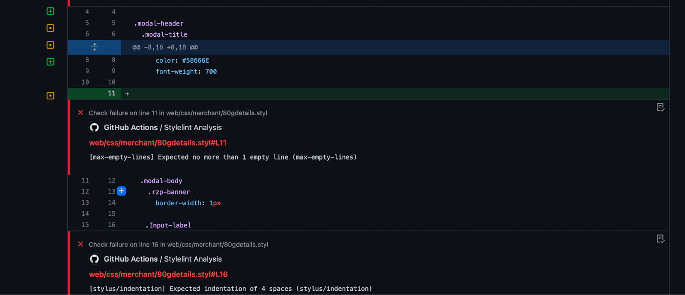
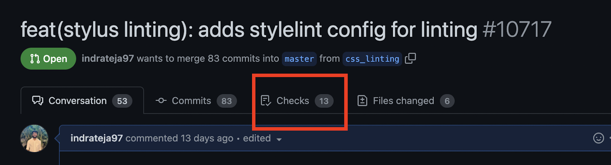
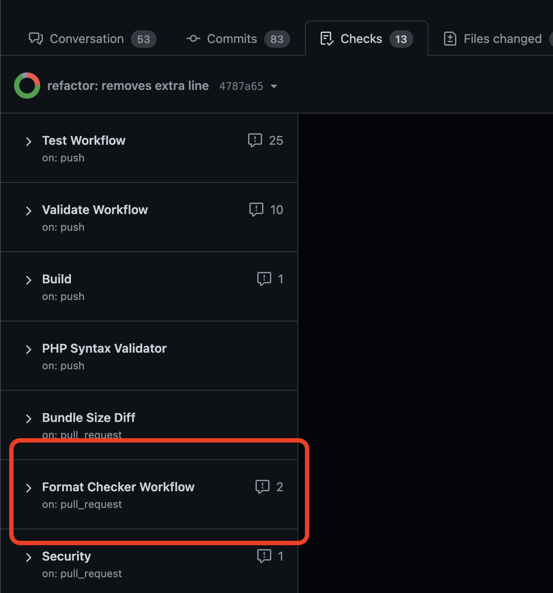
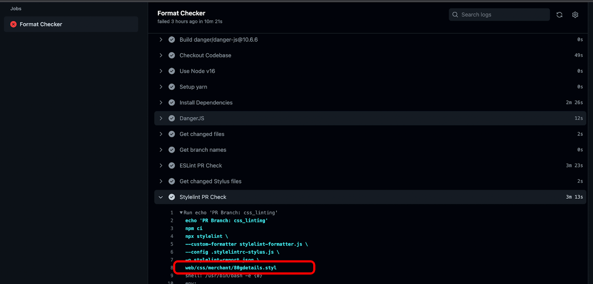

<header>
  <h1 align="center">CSS Guide</h1>
  <details>
    <summary align="center"><b>Changelog</b></summary>

| Version | Date         | Creators                | Reviewers            | Remarks       |
| ------- | ------------ | ----------------------- | -------------------- | ------------- |
| 1.0     | Aug 11, 2022 | `Sai Indra Teja Merugu` | `Sandesh Damkondwar` | Initial Draft |

  </details>
</header>

- [1. Overview](#1-overview)
- [2. Packages used](#2-packages-used)
- [3. Usage](#3-usage)
  - [3.1. Run the lint locally -](#31-run-the-lint-locally--)
  - [3.2. Stylelint CLI](#32-stylelint-cli)
- [4. CI Flow](#4-ci-flow)
- [5. Troubleshooting PR issues](#5-troubleshooting-pr-issues)
- [6. Why not auto-fix errors on pre-commit?](#6-why-not-auto-fix-errors-on-pre-commit)
- [7. Installing the VSCode Stylelint plugin](#7-installing-the-vscode-stylelint-plugin)
- [8. Follow up tasks](#8-follow-up-tasks)

### 1. Overview

To enforce the consistency of formatting and coding standards, a style guide for the stylus files, [Stylelint](https://stylelint.io/) is configured to follow the rules of [stylelint-config-standard](https://github.com/stylelint/stylelint-config-standard#readme) and [stylelint-stylus](https://github.com/stylus/stylelint-stylus#white_check_mark-rules).

### 2. Packages used

- [Stylelint (v14.0.0)](https://stylelint.io/) - Linter for Stylus files
- [Stylelint-stylus (v0.16.1)](https://github.com/stylus/stylelint-stylus#white_check_mark-rules) - Stylelint lint plugin to parse stylus files
- [Stylelint-config-standard (v24.0.0)](https://github.com/stylelint/stylelint-config-standard/tree/24.0.0#readme) - Standard rule set for CSS

### 3. Usage

#### 3.1. Run the lint locally -

Open a terminal in your root directory and run this command -

```bash
# this runs lint on all .styl files in web/css/merchant
pnpm lint:css —- web/css/merchant/**/*.styl web/css/merchant/*.styl
```

#### 3.2. Stylelint CLI

Run the below command to lint stylus files of Merchant Dashboard -

```
stylelint --config .stylelintrc-stylus.js web/css/merchant/**/*.styl  web/css/merchant/*.styl
```

Stylelint CLI docs: <https://stylelint.io/user-guide/usage/cli>

### 4. CI Flow

Stylelint check is added as a step in NX Validate GitHub Action which automatically runs on all the modified files of the PR. Errors are added as annotations on the files directly



### 5. Troubleshooting PR issues

What to do when you see Stylelint errors on GitHub PR files?

1. Go to PR Checks

   

2. Find Format Checker Workflow

   

3. Select Format checker > Expand stylelint PR check > Expand Run Echo PR Branch > Copy the list of the stylus files that changed in the PR (text after `-o stylelint-report.json`)

   

4. Run pnpm fix CSS – changed file list (this fixes auto-fixable errors)

   ```bash
   pnpm fix:css —- web/css/merchant/80gdetails.styl web/css/merchant/activation.styl
   ```

### 6. Why not auto-fix errors on pre-commit?

We’re not confident about the **Stylelint fix** as it did not work as expected initially. We want you to verify the changes made by stylelint before they’re committed.

### 7. Installing the VSCode Stylelint plugin

By using the stylelint plugin, you can identify and fix the errors before they’re even committed.

Install both extensions -

- [Stylus](https://marketplace.visualstudio.com/items?itemName=sysoev.language-stylus) - For identifying stylus files
- [Stylelint Plugin](https://marketplace.visualstudio.com/items?itemName=stylelint.vscode-stylelint)

Add this config in your workspace settings.json and restart VSCode. If you don’t have a .vscode folder in the dashboard repo -

1. Create a folder `.vscode`
2. Create a file with the name `settings.json` and paste this JSON into your settings.json file.

   ```json
   {
     "css.validate": false,
     "less.validate": false,
     "scss.validate": false,
     "stylelint.validate": ["css", "scss", "stylus"],
     "stylelint.snippet": ["css", "less", "postcss", "stylus"],
     "stylelint.stylelintPath": "./node_modules/stylelint",
     "stylelint.configFile": "./.stylelintrc-stylus.js"
   }
   ```

If your plugin still doesn’t work, make sure there’s no key `stylelint.config` in `~/Library/Application Support/Code/User/settings.json`

### 8. Follow up tasks

- [ ] Enforce more rules in Stylelint.
- [ ] Make stylelint part of pre-commit.
