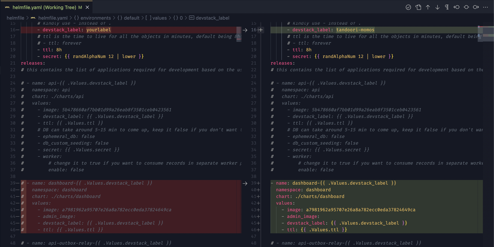
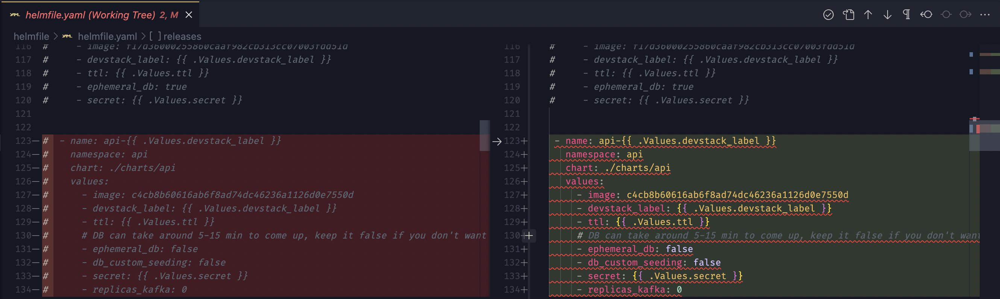

<header>
  <h1 align="center">Dashboard Devstack</h1>
  <details>
    <summary align="center"><b>Changelog</b></summary>

| Version | Date         | Creators           | Reviewers            | Remarks             |
| ------- | ------------ | ------------------ | -------------------- | ------------------- |
| 1.0     | Jan 20, 2021 | `Ritesh Ganjewala` | `Sandesh Damkondwar` | Initial Draft       |
| 1.1     | Dec 22, 2022 | `Ritesh Ganjewala` | `Sandesh Damkondwar` | Refactor & Clean-up |

  </details>
</header>

Hold your horses!! If you are coming from the [Local Setup Guide](./local-setup.md) and want to set up your dev environment for the dashboard, you need to go through the [Platform's Devstack Guide](https://docs.google.com/document/d/1fc9EKjGi1UcSZIEQ5c6p3r0ns5r6mlmbPCdeDek16Co/edit#heading=h.5l8ydtht277p) first, this will give you access to create pods on devstack.

**Already done?** Alright, let's go :rocket:

- [1. Prerequisites](#1-prerequisites)
- [2. Create your own Dashboard Pod](#2-create-your-own-dashboard-pod)
- [3. Use Dashboard with a specific API commit](#3-use-dashboard-with-a-specific-api-commit)
- [4. Tips and Tricks](#4-tips-and-tricks)

### 1. Prerequisites

Time to install some chrome extensions, yes we prefer using Chrome. But don’t be dishearted, you can use your fancy browsers if they have this or a similar extension available!

**1.1. ModHeader Extension**

- Go ahead and install the [Mod Header Extension on Chrome](https://chrome.google.com/webstore/detail/modheader-modify-http-hea/idgpnmonknjnojddfkpgkljpfnnfcklj)
- A little more setup on the extension is needed but we'll do that later in this guide.

### 2. Create your own Dashboard Pod

**2.1. Update Helmfile to add Dashboard Pod**

- Open the `helmfile.yaml` in your `kube-manifests` repo
- Uncomment the `dashboard` applications in the file
  

- From the [Dashboard repo](https://github.com/razorpay/dashboard/commits/master), copy the latest master commit which has passed the build actions, and paste it against the dashboard image.)
- Run this command in `kube-manifests/helmfile` directory to spin up your pod -

  ```sh
  helmfile sync
  ```

**2.2. Update Devspace File**

- Open the `devspace.yaml` file in your `dashboard` repo
- Update the `DEVSTACK_LABEL` value under vars with the same label in your `helmfile.yaml`

**2.3. Sync your local changes**

- Select the “dashboard“ namespace:

  ```bash
  devspace use namespace dashboard
  ```

- To push your local changes to devstack, create two terminals and keep these two commands running -

  ```bash
  # In terminal 1, this builds the dashboard frontend
  pnpm start
  ```

  ```bash
  # In terminal 2, this syncs the build files to your pod
  devspace dev --no-warn
  ```

**2.4. Use ModHeader to see your changes**

- Click on ModHeader Extension we installed earlier, and add a new Request Header with name `rzpctx-dev-serve-user` and value as your `devstack-label` from helmfile.yaml
- Go to <https://dashboard.dev.razorpay.in>

**and voila! It's done.** Now you can play around by changing files on your local machine and they should reflect on your devstack.

This is it if you want to make changes to the dashboard, but I suggest you go ahead and read the entire doc to learn what more can you do around the dashboard devstack.

### 3. Use Dashboard with a specific API commit

**3.1. Update helmfile to add API Pod**

- Open your `helmfile.yaml` in your `kube-manifests` repo
- Uncomment the `api` application
  

- From the [API repo](https://github.com/razorpay/api/commits/master), copy the API commit you want to test and paste the commit against your API image in the `helmfile.yaml`
- Open a terminal inside `kube-manifests/helmfile` directory, and run -

  ```sh
  helmfile delete && helmfile sync
  ```

**and... done!**

You can again [spin up your own dashboard pod](#2-create-your-own-dashboard-pod) on the same label and you should be able to use the API commit changes along with your dashboard changes.

### 4. Tips and Tricks

**4.1. How to freeze your change and share the devstack URL with someone else?**

- Once all your changes are synced to your devstack, stop the terminal which is running `devspace dev --no-warn` . This should stop syncing your changes.
- Now you can share the direct devstack URL with anyone and they should be able to see your changes without the ModHeader extension. Your devstack URL would be in this format - `https://dashboard-<devstack-label>.dev.razorpay.com`

So let’s say if my devstack label is `tandoori-momos`, the devstack URL would be `https://dashboard-tandoori-momos.dev.razorpay.in`
_Suddenly feeling hungry, aren't you?_

**4.2. How to make a second dashboard pod?**

Okay, this is the same as creating the first one. Let's see -

- Change the devstack label in `helmfile.yaml` in `kube-manifests` repo.
- Open a terminal inside `kube-manifests/helmfile` directory, and run -

  ```sh
  helfmile sync
  ```

This should create the dashboard pod with a new devstack label

> **Note -** To sync your changes to the new pod, change the devstack label in `devspace.yaml` in your dashboard repo.

**4.3. How to add new Environment Variables in .env.\* files and sync them on the devstack**

The most straightforward way is to push your changes to Github, and use that commit id in your `helmfile.yaml`. You’ll be able to see the changes.
