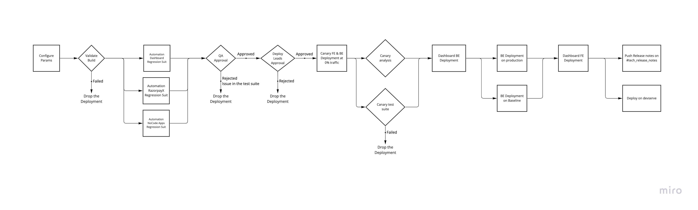

<header>
  <h1 align="center">Deployment Guide</h1>
  

    
<b>Changelog</b>

| Version | Date         | Creators             | Reviewers                                                                 | Remarks       |
| ------- | ------------ | -------------------- | ------------------------------------------------------------------------- | ------------- |
| 1.0     | May 23, 2022 | `Sandesh Damkondwar` | `Aakash Raina` `Snehasish Das Gupta` `Prashant Chaudhary` `Rahul Makhija` | Initial Draft |
| 1.1     | Dec 09, 2022 | `Ritesh Ganjewala`   | `Sandesh Damkondwar`                                                      | Refactored    |

  

</header>

- [1. Deployment Flow](#1-deployment-flow)
- [2. Schedule and Permissions](#2-schedule-and-permissions)
- [3. Deployment Config Options](#3-deployment-config-options)
- [4. Deployment Guides](#4-deployment-guides)
  - [4.1. Steps to follow for Regular Deployment](#41-steps-to-follow-for-regular-deployment)
  - [4.2. Steps to follow for Hotfix Deployment](#42-steps-to-follow-for-hotfix-deployment)
- [5. Post-deployment](#5-post-deployment)
- [6. Appendix](#6-appendix)

### 1. Deployment Flow

_HLD - **[Miro link](https://miro.com/welcomeonboard/b09jSTBDMXJzWmxjNVczdksySVhHek54dlh1YTVUU1N5WEh6TTZQU2xyam5rOEN0WjlvS3FGZWh2ZWJkckx3a3wzMDc0NDU3MzYxMzA4NTE1Mjg0?invite_link_id=397827286770)**_

### 2. Schedule and Permissions

| Deployment Type | Timings                                 | Permission to Start                                                           | Permission to Approve                                                                                                                                               |
| --------------- | --------------------------------------- | ----------------------------------------------------------------------------- | ------------------------------------------------------------------------------------------------------------------------------------------------------------------- |
| **Regular**     | Monday, Wednesday, Friday (10:00-17:00) | [Member of Frontend](https://github.com/orgs/razorpay/teams/frontend/members) | [Member of Deploy Leads](https://github.com/orgs/razorpay/teams/deploy-leads/members) (tag @dashboarddeployleads on slack for approval once all test suites passed) |
| **Hotfix**      | No fixed time window                    | [Member of Frontend](https://github.com/orgs/razorpay/teams/frontend/members) | Director Level (Chirag Patel/Rizwanul Haque/Director/Director+)                                                                                                     |

> **Note -**
>
> - Outside the window, only critical fixes can be deployed.
> - The safest window for taking the changes live is between 1-2 PM. As traffic is at the lowest.

### 3. Deployment Config Options

|                      | Description                                                                                                                   | Values             | Default   |
| -------------------- | ----------------------------------------------------------------------------------------------------------------------------- | ------------------ | --------- |
| `deployment_process` | If `hotfix` is selected, it will skip all regression test suites and Canary Analysis no matter the value of `skip_regression` | `regular` `hotfix` | `regular` |
| `skip_regression`    | Skip all regression test suites but Canary Analysis will run. Select `yes` only if you have QA approval                       | `yes` `no`         | `no`      |

### 4. Deployment Guides

#### 4.1. Steps to follow for Regular Deployment

1. Start the deployment with the latest master commit id with default parameters
2. Wait for the automation test suite to finish with success
3. Request for Approval **once automation test suites are successful** by tagging @dashboarddeployleads on [#payments-dashboard](https://razorpay.slack.com/archives/C0156ULAEFQ) channel
4. If the automation test suite failed, check the issue on the report portal - New thread will be started on [#payments-dashboard](https://razorpay.slack.com/archives/C0156ULAEFQ) channel, and instructions will be mentioned on the thread on how to check the issue on the report portal and whom to reach out for those test suite failures if you are not able to debug the issue on the report portal. E.g. [X failure](https://razorpay.slack.com/archives/C0156ULAEFQ/p1648107158213629), [Dashboard failure](https://razorpay.slack.com/archives/C0156ULAEFQ/p1670232372971139), [No Code Failure](https://razorpay.slack.com/archives/C0156ULAEFQ/p1670231754874099). Once X, Dashboard & No Code Apps QA provide manual sign-off, restart the deployment pipeline by skipping the regression suite (Make sure to mention the slack link of manual sign-off in the description).
   - [Runbook for report portal](https://razorpay.slack.com/archives/C0156ULAEFQ/p1645778702401969?thread_ts=1645624559.309269&cid=C0156ULAEFQ)
   - [Video KT](https://razorpay.slack.com/archives/C0156ULAEFQ/p1645779343096379?thread_ts=1645624559.309269&cid=C0156ULAEFQ)

#### 4.2. Steps to follow for Hotfix Deployment

1. Fork out of the [deployed commit](https://dashboard.razorpay.com/commit.txt) and create a branch **with the prefix** `hotfix/` (do not fork from master)
2. Cherry-pick the commit that needs to be deployed as a hotfix.
3. Get the latest commit id of your new branch for deploying that commit id.
4. Cross-check the diff between the currently deployed commit and the new commit id to be deployed. It should be carrying only the targeted changes.
5. Start the deployment with the above commit id
6. Request for approval by tagging **@dashboarddeployleads** on the [#payments-dashboard](https://razorpay.slack.com/archives/C0156ULAEFQ) channel. Use the **Hotfix Approval Request** template given below.
7. Take the approval of the directors (Deploy leads will approve the deployment post permission from directors)
8. After deployment/while deploying of hotfix make sure the changes get merged to master immediately (If you miss this step, new deployments will not have the hotfix changes in it)

> **Note for hotfix deployments -**
>
> - The hotfix process is only for critical UX/UI issues. Don’t use this process for feature/product deployment.
> - Changes should be minimal on the diff, it should not have more than 10-15 lines of code changes on the difference.
> - @dashboarddeployleads needs to make sure the PR format is followed before deploying as a hotfix.
> - For hotfix deployment, you need a sign-off from the directors and make sure one round of sanity is done by someone else from the team.
> - Deploy as a hotfix only if the changes are less than 15 lines of code and the deployment does not carry any other changes than yours. And changes should not have any breaking changes in it.

##### 4.2.1. Hotfix Approval Request Template
> **Summary:** <50 word summary of the issue> <What is broken> Ex: 100% of the Merchants are unable to invite team members to their accounts\
> **Is it caused by a change:** Yes/No\
> **Owner of the change:** Developer/Team\
> **Reference to the change:** PR Link / JIRA Ticket / Slack Thread\
> **PR Approvers of the change:** Developer/Developers\
> **Escalation Source:** Dev Testing / Merchant Escalation / Alerts\
> **Escalation Reference:**  Slack / PD / Sentry / Any Relevant Links\
> **Potential Impact:** Merchants Impacted / GMV Loss\
> **Best resolution:** Rollback / Forward Fix\
> **Link to Fix (if applicable):** PR Link

##### 4.2.2. Post Hotfix Deployment Template
- Why was this not caught in Dev Testing?
- Why was this not caught in Pre Prod Suite?
- ETA to add the scenario to Pre Prod Suite

### 5. Post-deployment

- Monitor the release here on Sentry for new issues once your deployment goes live.
- Run the revert pipeline immediately if you see any adverse effects on production.

### 6. Appendix

- Video Recording of the Deployment Process - [Link](https://razorpay.zoom.us/rec/share/bI7fK3KXVXq0XHsnnalR6lkeCttrJ8GdmU6bv29Iy8RqSr4tRFQ5NZ6sCKjkXO3l.ooj7Fop-rv6ua76W) Access Passcode: `hYbh@5T.`
