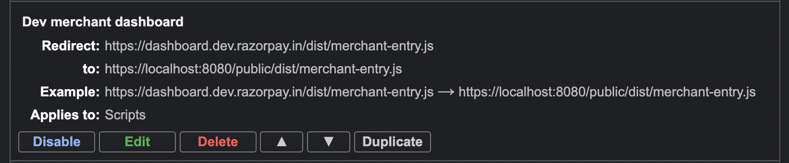
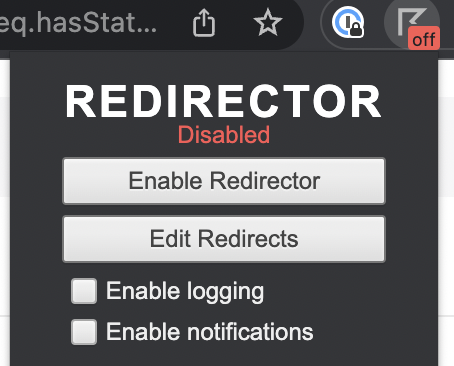
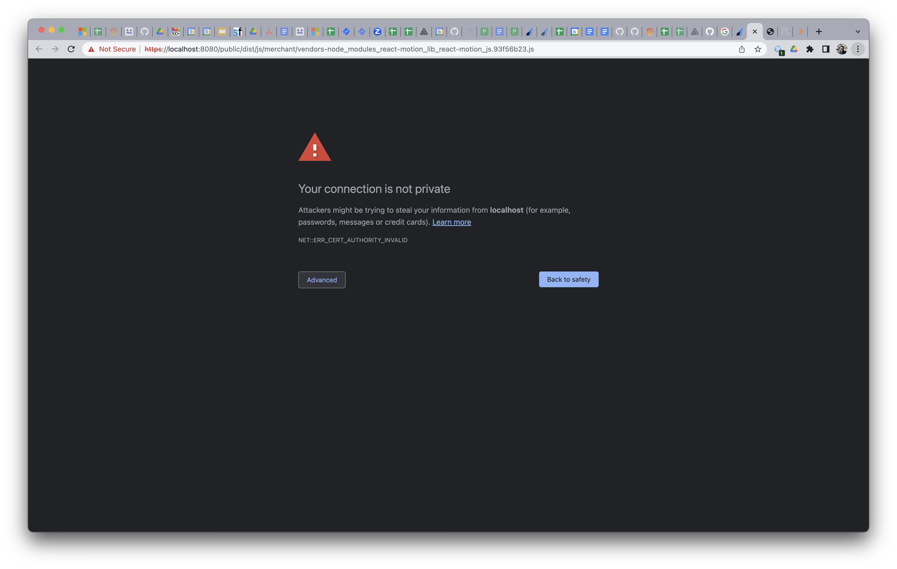

<header>
  <h1 align="center">HMR Development Guide</h1>
  <details>
    <summary align="center"><b>Changelog</b></summary>

| Version | Date         | Creators     | Reviewers            | Remarks       |
| ------- | ------------ | ------------ | -------------------- | ------------- |
| 1.0     | Apr 07, 2023 | `Indra Teja` | `Sandesh Damkondwar` | Initial Draft |

  </details>
</header>

Tired of endless scrolling on instagram/reddit because you have to wait for at least 10-15 seconds (10 seconds if you're lucky) to see your change on dev?

Your prayers are finally answered.

(🥁🥁🥁 in background) _HMR_ is now enabled on Dashboard. You don't believe it? Try the setup and see it for yourself.

- [1. Redirector setup](#1-redirector-setup)
- [2. Development using HMR](#2-development-using-hmr)
- [3. Checklist to use HMR](#3-checklist-to-use-hmr)

Assuming you're ready with frontend installation.

### 1. Redirector setup

- Install the [Redirector Extension on Chrome](https://chrome.google.com/webstore/detail/redirector/ocgpenflpmgnfapjedencafcfakcekcd)

- You can directly import this config in your Redirector

  [Redirector.json](./assets/hmr-redirector.json)

- Or add the following config in the Redirector extension.

  ```
    Redirect: https://dashboard.dev.razorpay.in/dist/merchant-entry.js
    to:	https://localhost:8080/public/dist/merchant-entry.js

    Also, select scripts under advanced options
  ```

  

  -

### 2. Development using HMR

**2.1. Start Dashboard server**

```
pnpm serve
```

**2.2. Enable Redirector**



**2.3. Accept invalid SSL certificates**

- Login on https://dashboard.dev.razorpay.in, merchant entry file won't load due to SSL invalid error. Open dev tools and find the merchant-entry request in network tab.

- Open merchant entry file link in a new tab and you'll see this error.
  

- Click on Advanced > Proceed to localhost (unsafe), you'll be navigated to the merchant entry file.

- Refresh the dashboard, merchant-entry call will be successful now. But, all the modules will fail to load due to SSL error. Open any one of those modules in a new tab and accept the invalid SSL certificate.

- Refresh dashboard again and VOILAAAA, welcome to the HMR world :raised_hands:.

### 3. Checklist to use HMR

- Run pnpm serve at the root (starts webpack server on port 8080)
- Accept SSL invalid certificates by opening https://localhost:8080/public/dist/merchant-entry.js directly.
- You can also update google chrome settings to always allow invalid certificates for resources loaded from localhost (will also add steps to generate and use a valid certificate).
  - Open Google Chrome browser.
  - Type chrome://flags/#allow-insecure-localhost in address bar.
  - Click on Enable.
  - Select “Relaunch Now” option displaying at the bottom after making the changes
- Make sure localhost port is configured to **8080** in your redirector config.
- You don't need to run http-server in the public folder.
