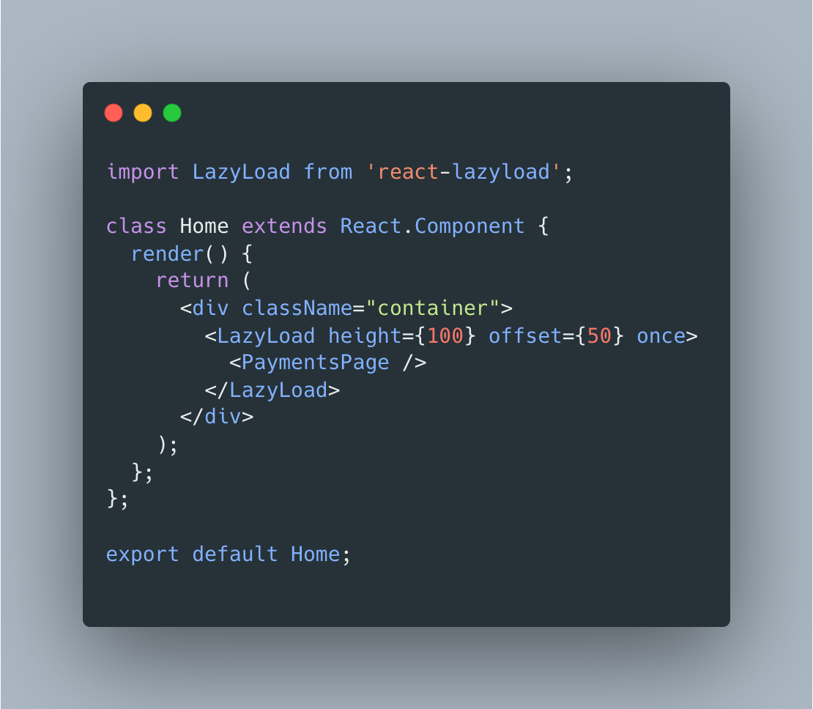
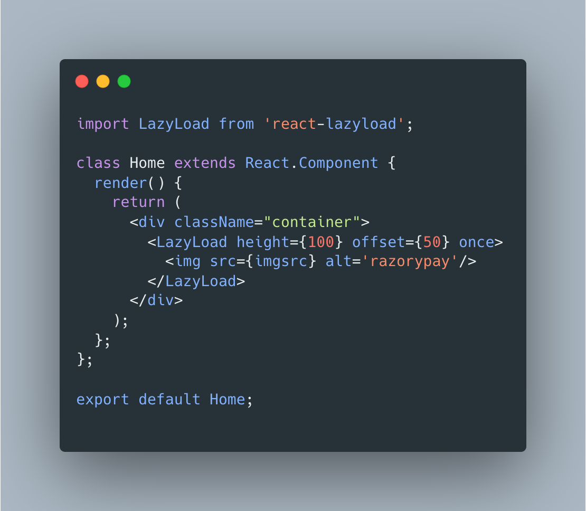
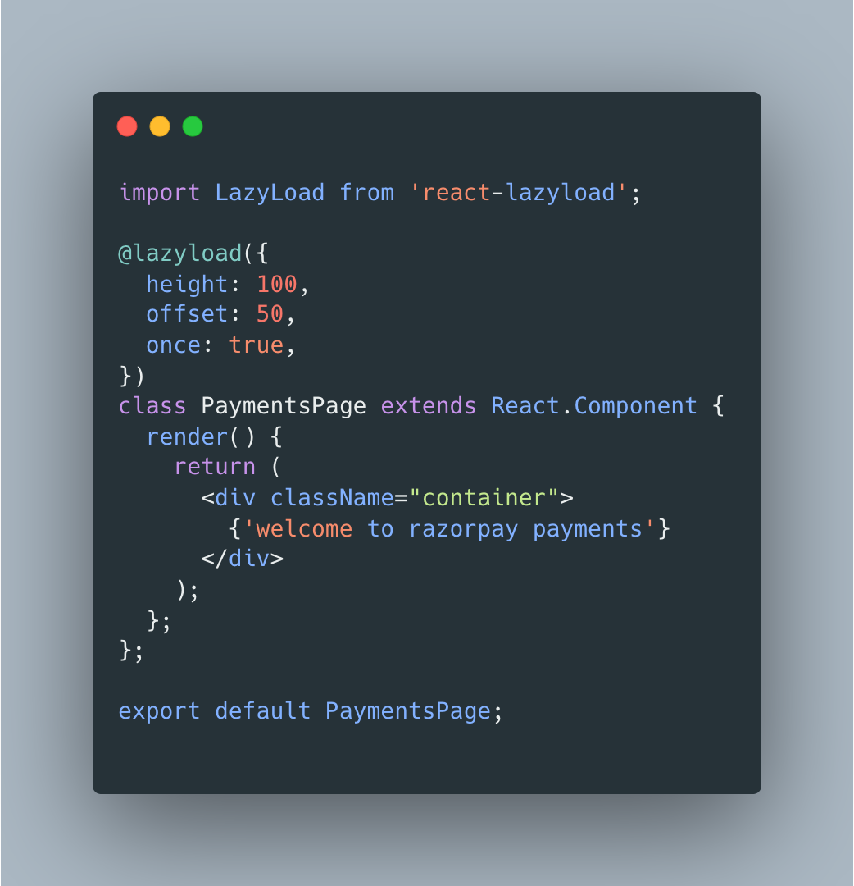

<header>
  <h1 align="center">Dynamic Lazy Loading Components</h1>
  

    
<b>Changelog</b>

| Version | Date         | Creators        | Reviewers            | Remarks       |
| ------- | ------------ | --------------- | -------------------- | ------------- |
| 1.0     | Jul 28, 2022 | `Rishav Loomba` | `Sandesh Damkondwar` | Initial Draft |

  

</header>

- [1. Problem](#1-problem)
- [2. Target](#2-target)
- [3. Solution](#3-solution)
- [4. Usage](#4-usage)
- [5. Things to take care](#5-things-to-take-care)
- [6. References](#6-references)
- [7. Open Questions and Queries](#7-open-questions-and-queries)

### 1. Problem

Page Load time is largely due to the rendering of all components and API call-dependent components which delays the first paint rendering and also blocks the main thread which delays UI interaction and affects merchant experience on the dashboard.

### 2. Target

Our target is to optimize the page by Lazy loading of components and API calls which fasten the page load and increase user interaction and provide a better user experience.

### 3. Solution

1. We can only render components when it comes in View Port (currently using 50px offset), using a reference in the Dom, once that ref will reach the viewport we render that component, and on-mounting of that component will trigger the API call, and complete the rendering.
2. Lazy loading of images and banners (both in single or in carousel) which will improve performance.
3. To achieve this functionality, we are using the ‘react-lazyload’ library which is providing support for components and images, and much more (we are using this library because it covers all the edge cases and lightweight and provides many features).

**Package/Tech to use -** [react-lazyload](https://www.npmjs.com/package/react-lazyload) ([GitHub](https://github.com/twobin/react-lazyload))

### 4. Usage

1. As component

   1. Component

      

   2. Image

      

2) As decorator

   

### 5. Things to take care

We used `React.lazy` for code splitting in the above PR. In our case when a component comes in the viewport, and after a chunk is loaded from the server and starts execution, it will cause a glitch (like a blink in the window). So we removed `React.lazy` imports and after that everything worked well.

### 6. References

- Sample PR - <https://github.com/razorpay/dashboard/pull/10607>
- Hotfix PR - <https://github.com/razorpay/dashboard/pull/10637>
- Demo - [Live demo for lazy loading of components](https://drive.google.com/file/d/1ey-8xs15_6pi1FLtWW07x3V8fUbpUbCF/view?usp=sharing)

**Impact:**

1. Optimizes the web page performance which results in improving both perceived and real loading time of pages(LCP).
2. Will provide a better user experience to merchants.
3. Helps in decreasing HTTPS calls during first-page load.
4. Improves page speed Audits.
5. Reduce server burden (or save bandwidth) by reducing unnecessary API calls
6. Only by loading 3 components lazily(without using `React.lazy`) when it is in viewport we were able to skip 5 APIs out of 41 in total api on the dashboard load

### 7. Open Questions and Queries

Slack name: Rishav Loomba, Sandesh Damkondwar
