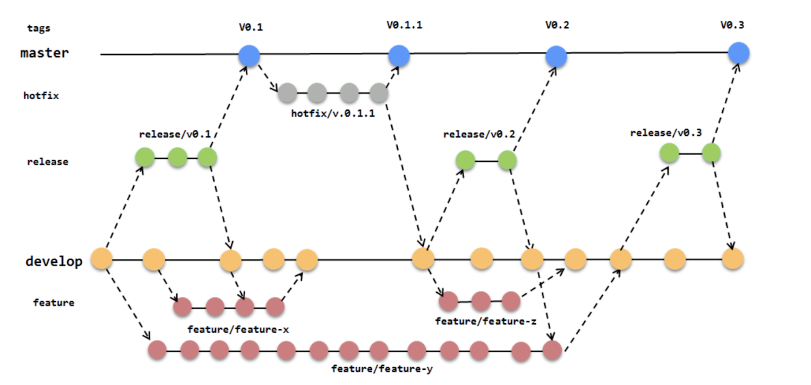
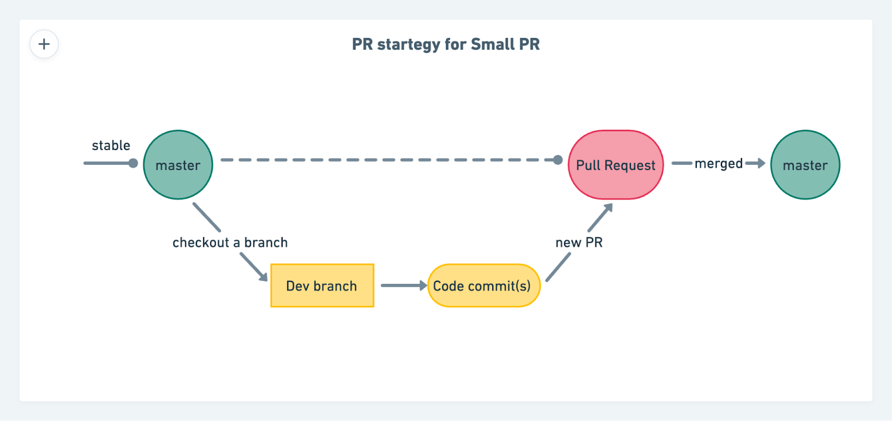
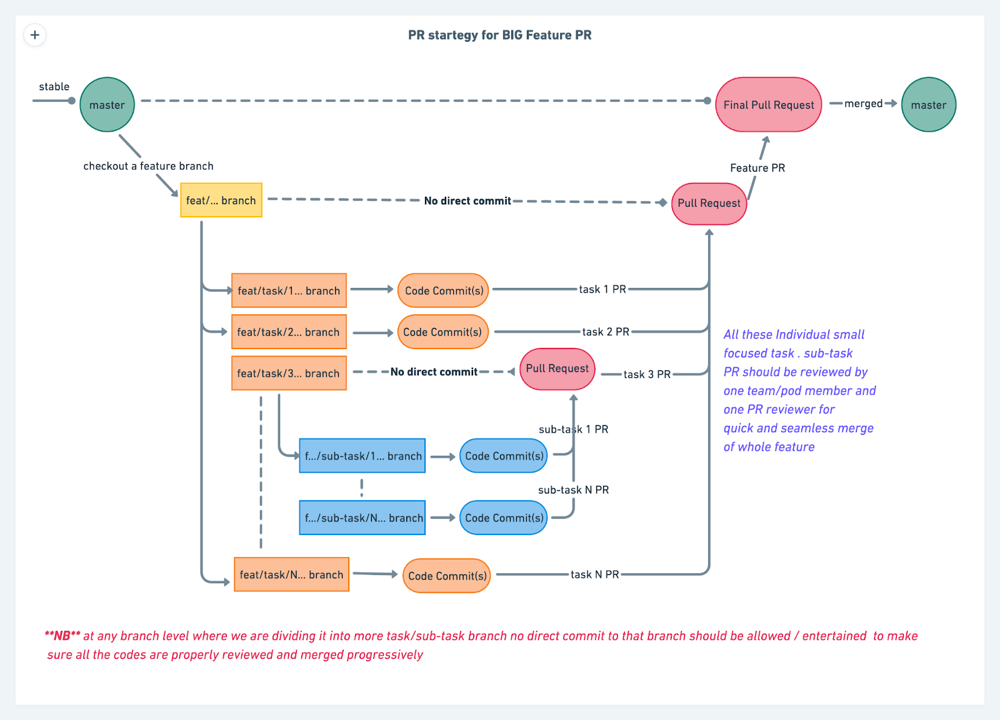
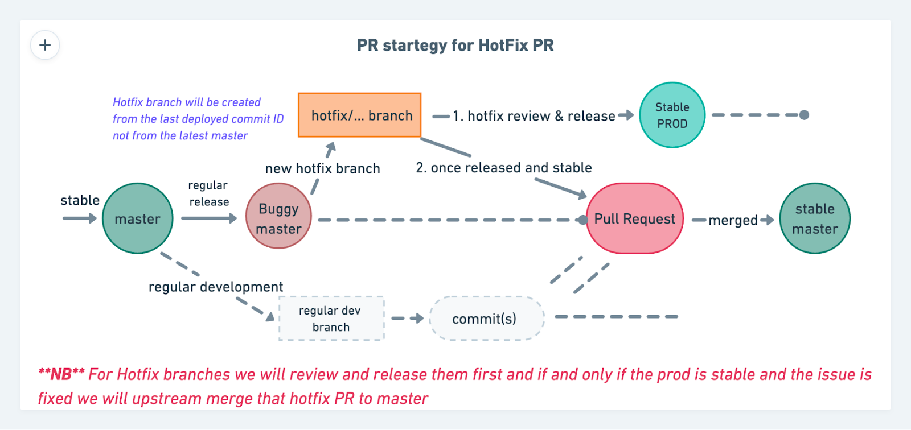

<header>
  <h1 align="center">Pull Request Strategy</h1>
  

    
<b>Changelog</b>

| Version | Date         | Creators              | Reviewers            | Remarks       |
| ------- | ------------ | --------------------- | -------------------- | ------------- |
| 1.0     | Aug 18, 2022 | `Snehasish Das Gupta` | `Sandesh Damkondwar` | Initial Draft |

  

</header>

- [1. What is a Pull Request?](#1-what-is-a-pull-request)
- [2. Different Standards of PR strategies](#2-different-standards-of-pr-strategies)
- [3. What are the challenges we are facing now?](#3-what-are-the-challenges-we-are-facing-now)
- [4. The Solution](#4-the-solution)
  - [4.1. What is ‘Small and Focused’?](#41-what-is-small-and-focused)
- [5. Small PR 🐜](#5-small-pr-)
- [6. BIG Feature PR🐘](#6-big-feature-pr)
- [7. Hotfix PR](#7-hotfix-pr)
- [8. References](#8-references)

### 1. What is a Pull Request?

Pull requests are a common way to get your code changes reviewed, merged, and released in production. The path from developing a piece of code to making that code live in production can be paved in many different ways and those ways are called branching/ pull-request strategies.

### 2. Different Standards of PR strategies

There are many other development and version management strategies there to reduce the load on developers as well as reviewers and all of them mostly aim to reduce the friction between developing to go live time by streamlining and regularizing the process. Many such popular ways are

1. Trunk-based development - <https://trunkbaseddevelopment.com/>
2. Feature branching strategy
3. Release branching strategy

An example of release and feature branching strategy is (😎)

Now looking at all these different paths and approaches we need to use the one which suits our needs the best so let’s dive deep into our PR scenarios and understand how we want to strategies each scenario to make the best out of it.

### 3. What are the challenges we are facing now?

In the current scenario, there are many developers who are contributing to the [Dashboard](https://github.com/razorpay/dashboard) and [SME dashboard](https://github.com/razorpay/frontend-sme-dashboard) simultaneously, and as we manage one release branch **master** only so every PR is pointing towards that, and we are seeing a huge influx of PR in both the repositories. So there is a huge load coming on to the reviewers to review quickly and efficiently and also to the developers to make their changes reviewed and live to production to meet the deadline. All of these create a lot of noise, delay in review, and a huge load on the reviewers to review PR properly so that we don’t push sub-par code to production. So now to streamline this we are introducing the following strategies for addressing all and making it a win-win situation for all stakeholders. 😊

### 4. The Solution

Let’s say the PR for the [Dashboard](https://github.com/razorpay/dashboard) repo and [SME dashboard](https://github.com/razorpay/frontend-sme-dashboard) repo can be classified into primarily 3 categories -

1. Small PR - mainly subsequent changes or small alterations and updation of an existing code)
2. Feature/Refactor PR - PR for a whole new product feature or whole revamp of an existing flow with completely new code.
3. Hotfix PR - mainly where there is a production issue that needed a fix ASAP.

These two primary segments should be treated and planned distinctively from the developers’ side and also from the reviewers’ side. The whole idea of any PR review strategy is to make life easier for both parties and to make that happen one important thing to keep in mind here is that your changes should be **small and focused**

#### 4.1. What is ‘Small and Focused’?

Not all small PRs are focused. I might sneak five unrelated one-line changes into a PR. While it feels like that will enable me to move quickly, it also runs the risk of four unrelated changes being held up in review because the other is controversial.

Similarly, Not all focused PRs are small. I might put an entire feature in one PR, and while it is focused, it’s still going to be difficult for you to review a large number of changes thoroughly.

To make our PR reviewers’ jobs easier, we’re looking for the intersection of small _and_ focused. Changes that are cohesive and without distractions. Code that accomplishes one small thing. This really helps both reviewers and developers to quickly and properly review the code changes and accelerate the timelines for a code change to go live making the release path smooth sailing.

One thing to keep in mind with this idea is that the recommendation for **‘small and focused’** PRs does not include the word **‘complete’.** Everyone likes their work to be very polished before it’s done, but when we’re iterating quickly the polish can come in a follow-up PR. This is the biggest challenge we need to overcome — **finding the balance between polish and iteration.** So that we don’t release bad-quality code and also don’t delay a project significantly to achieve perfection.

**_Let’s talk about each type one by one and how we want to tackle it_**

### 5. Small PR 🐜

**_What is categorized as a Small PR?_**

Let’s say you are developing a feature/fix on top of an existing feature module with around 500 - 600 diff delta with around max 10 - 12 file changes, in this case, we can follow the below strategy to branch out, develop and merge the code to master to make our changes live in production.

We can follow this simple approach of creating a development branch from the master and then commit(s) our code directly in that branch before raising a PR to the master for small and focused changes.

### 6. BIG Feature PR🐘

**_What is categorized as a BIG feature PR?_**

When you are developing a whole new feature from the scratch and it has a good widespread impact across the code base and also involves changes to many existing files or the addition of many new files to support the development of this new feature and when we raise a PR with all these changes at once to master to take the feature live usually with a diff delta of over 3000 - 4000 lines with over 20+ files delta can be categorized as a BIG feature PR.

**_Why do these PRs need to be categorized separately? Why can we reuse the same strategy as mentioned above for small PR?_**

Let’s start by stating that if we follow the same strategy of PR for this then we will end up having a PR with over 3000 - 4000 line changes spreading across around 20+ even sometimes 40+ files where every single delta needs to be reviewed to make sure the changes are valid as per coding norms of the org and also have no side effect to any of the existing modules of code. This becomes a very very hectic and near to impossible Job for reviewers. This eventually leads to any of these below 2 scenarios -

1. To push the code faster, the reviewer will do a quick and loose review which might lead to production bugs and breakages
2. To review the code correctly, the reviewer will require more and more time (~ 4-7d) because he/she also needs to accommodate this mammoth task as an extra to his/her already planned work, so eventually, releases will be delayed and the project’s timeline will be derailed.

**_How to tackle this kind of PR?_**

This is actually a very debatable and opinionated subject matter. But the most important thing we need to remember is our theme of the discussion **“Small & Focused”** and the most battle-tested approach to achieve this is the **Feature Branching Strategy (task branching)** to break down this whole project into small chunks to make sure we can progressively keep on reviewing/merging PR to our feature/milestone branch with the help of reviewers so that when we want to make the whole featured merged and released from the master that BIG pr will be nothing but collective changes of all those small & focused PR which were already reviewed along the way so this PR can be merged very quickly and with very less effort which will help avoid both the above-mentioned scenario and will be a win-win situation for both reviewers and developers.

A quick representation of the approach we need to take to tackle this is

One thing to notice here is integrating code a little at a time. What we mean by that is for a feature when we have a long-lived feature/epic branch we can introduce code into those branches by PR. so PR can be opened to any branch, not just to master.

The core principle of this is to **start with small scope → slice your stories small**

There are many ways to break a story smaller, and all of them enable you to integrate code sooner in the form of smaller PRs:

- Separate CRUD (Create, Read, Update, Delete) operations and ship them one at a time
- Separate by user role
- Separate individual edge cases
- Separate a simplified experience from an enhanced version

Think of these smaller scoped features as self-contained vertical slices of functionality. As each one is merged quickly, your team can start building the next slice. And it will make the reviewers live as cool as the winter breeze.

Couple of strategies we can follow if we want to even make these little compact vertical changes merged to master directly as we progress through a very long feature / epic development which can span for a couple of months are.

1. **[Feature toggles](https://trunkbaseddevelopment.com/feature-flags/)** - When we introduce new code we can hide it behind a feature flag/experiment (spiltz or razorx) until we’re ready for everyone to see/use it.
2. **Hidden routes** - When we redesign or modernize an existing route we’ll create a _second_ similar route. We hide the in-progress page behind that new route and don’t share it until it’s ready. 🤫

These are just some ways we can make our release versioned and continuous without having to lift the burden of the whole feature at once.

### 7. Hotfix PR

Other than these two above-mentioned PR types, there is one more important PR that we need to do a quick review and release in times of dire needs called Hotfix

**_What is a Hotfix?_**

When there is a P0 production bug and we know the cause and fix for the same we want to just deploy that many changes only on top of our production code to fix the bug and that commit which has only that many changes is considered as a Hotfix commit/PR.

**_How to take care of the Hotfix PR?_**

A simple way of creating a hotfix branch, developing and then releasing and upon stability merging it back to the master to make it stable again. A quick representation of the same is as below -

### 8. References

1. <https://dzone.com/articles/why-i-prefer-trunk-based-development-over-feature>
2. <https://www.perforce.com/blog/vcs/best-branching-strategies-high-velocity-development>
